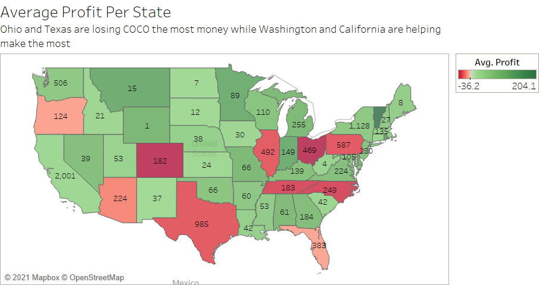
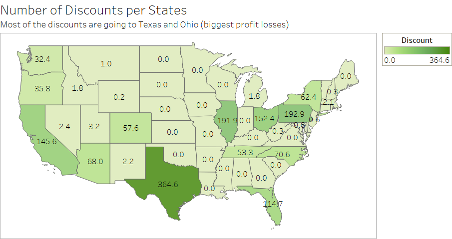
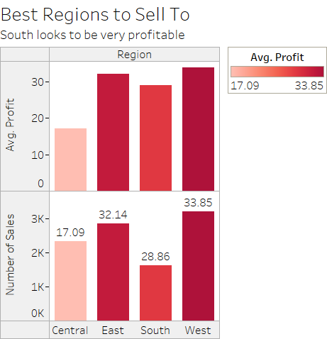

# COCO.com (Completely fake)

**Author:** Erik Sanders

###  I. Problem Statement

COCO has been doing well the past couple of years and wants to continue doing well. They are interested to know if their profits can be predicted and if there is anything they can do to improve their profits.  Some of the issues they have been having is working with two sets of dates and trying to decide to what to do with some of the information. 

###  II. Solutions

The solution that has been implemented is a machine learning model called XGBoost that can predict with-in approximately $68.00 of a given days profits for a month in the future.  This can be handy for days that the site sells a lot of products or products that can be expensive.  More data and fine tuning are required to get it narrowed down farther. 

Some things that COCO could look into to improve their sales is by focusing where they are selling. Figure 1 shows that Texas and Ohio are the companys biggest losses and that California and Washington are the greatest successes.  We recommend that you focus more advertisment in the more profitable states and offer less discounts to the others.

---
**Figure 1**

*Numbers inside of each state are the number of transactions*

---

A further look into why Ohio and Texas are losing the company might be because of the number discounts they have taken advantage of. In figure 2 we can see that states that lose the company money take big advantage of the discounts presented on their site.

---
**Figure 2**

---

We can also take a look at what places are not being used to their fullest potential. The southern region is a prime example of this, looking at Figure 3 we see that even though the South did not make as many transactions as the others, it still is really close to making considerable profits.

---
**Figure 3**

---

###  III. Conclusion

In all, although COCO has been doing reasonably well for the past few year, we have seen that their is still plenty of room for growth and expansion.  With a model that can reasonably tell you what the next month's profits will be, you can decide whether your marketing plans will be successful.  To get better results, the model will need additional adjustments but will work within reason for now.   
